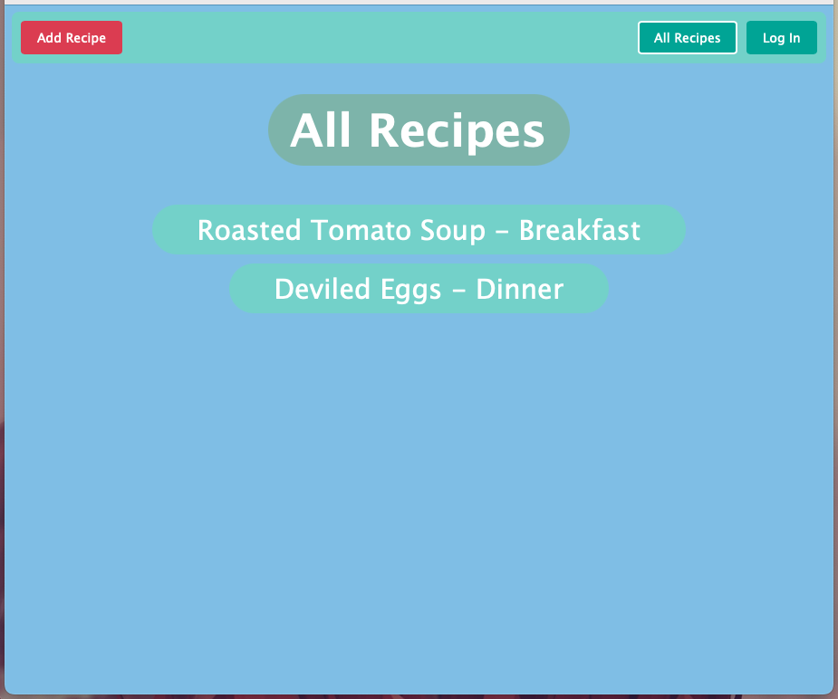
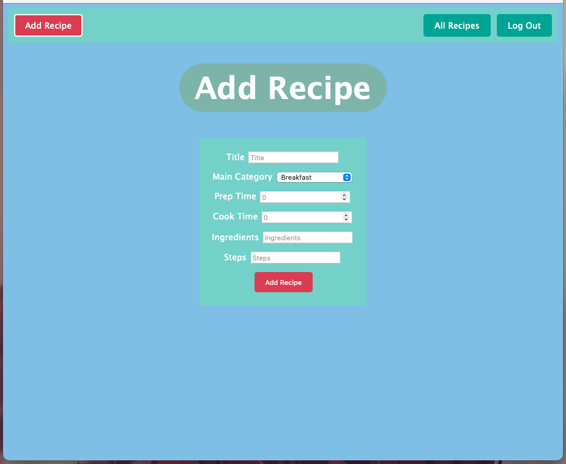
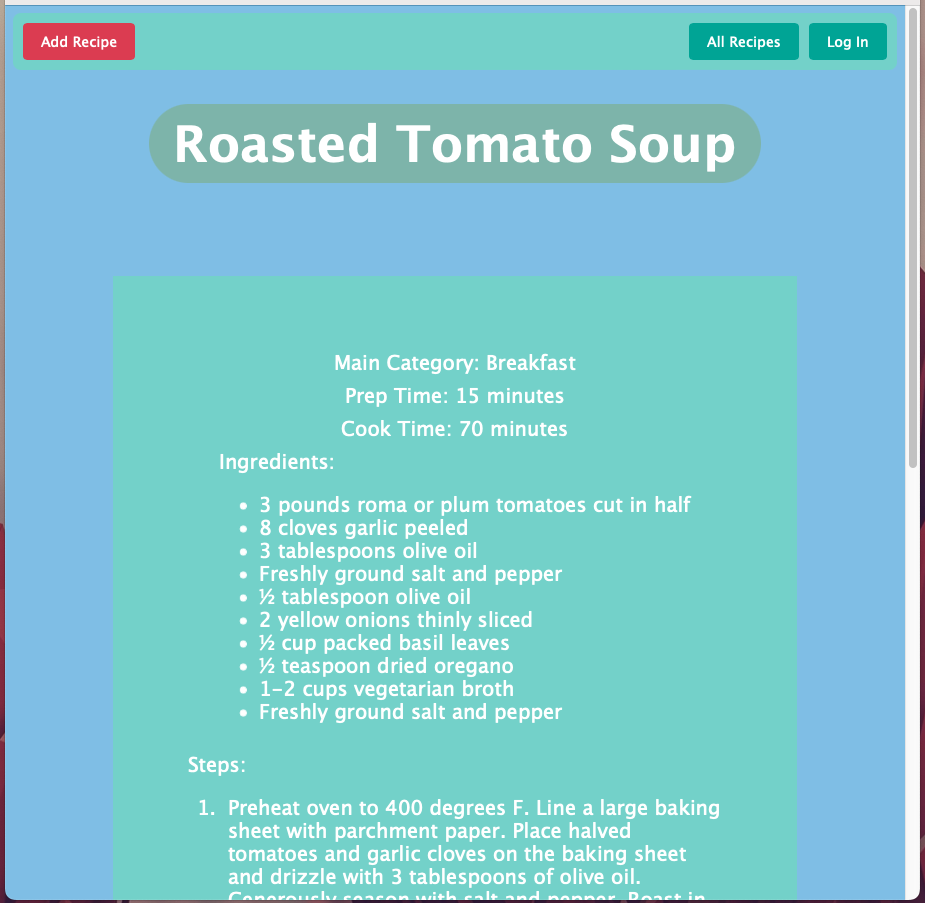

# Recipe Tweaker

Tired of those recipe websites that try to tell you their grandma's lifestory before finally getting to the recipe halfay down the page? Yeah, me too. Recipe Tweaker solves this problem by creating a platform for users to easily add simple, straight to the point recipes. 

# Technologies Used
- JavaScript
- HTML
- CSS
- Express.js
- Node.js
- Passport.js
- MongoDB
- Mongoose

# Getting Started
https://recipe-tweaker.onrender.com

# Future User Stories
- AAU I want to be able to comment on other users' recipes when I'm signed in
- AAU I want to be able to delete my own comments when I'm signed in
- AAU I want to be able to browse my own posted recipes when I'm signed in
- AAU I want to be able to edit my own comments when I'm signed in
- AAU I want to be able to rate other users' recipes when I'm signed in
- AAU I want to be able to filter all recipes to make browsing easier
- AAU I want to be able to click on the rating of a recipe or tweak to toggle from total rating to a percentage (upvotes/total votes)
- AAU I want to be able to make my recipe private when I'm signed in
- AAU I want to be able to favorite other user's recipes and view them all in a list together when I'm signed in
- AAU I want to be able to sort comments by their rating or age
- AAU I want to be able to search for recipes
- AAU I want to be able to filter and sort other users' recipes
- AAU I want to be prompted to sign in after a little bit, so that I don't forget to sign in
- AAU I want to be able to download a text version of any recipe

# Screenshots

